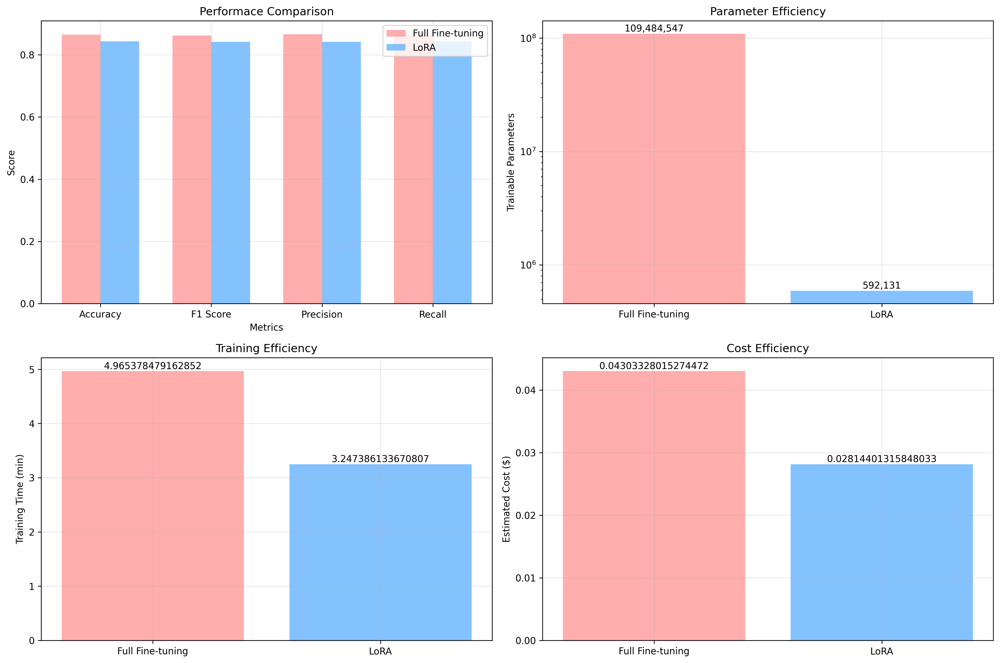

# Performance Comparison: Full Fine-tuning vs. LoRA Fine-tuning of BERT

This report compares the performance of two fine-tuning methods for the BERT model on a financial text classification task: full fine-tuning and Low-Rank Adaptation (LoRA), based on the results from the `Fine-tuning/Fine_tune_BERT.ipynb` notebook.

## Performance Metrics

The following table summarizes the performance of both models on the validation set:

| Metric    | Full Fine-tuning | LoRA Fine-tuning |
|-----------|------------------|------------------|
| Accuracy  | 0.865           | 0.843           |
| F1 Score  | 0.862           | 0.842           |
| Precision | 0.866           | 0.842           |
| Recall    | 0.865           | 0.843           |

## Training Details

The following table compares the training time and the number of trainable parameters for both models:

| Metric                | Full Fine-tuning | LoRA Fine-tuning |
|-----------------------|------------------|------------------|
| Training Time (min)   | 4.97          | 3.25          |
| Trainable Parameters  | 109,484,547      | 592,131          |

## Cost Analysis

The cost analysis is based on the training time and an estimated cost of a standard cloud GPU instance (e.g., AWS g4dn.xlarge with a single NVIDIA T4 GPU) at $0.526 per hour.

| Model              | Training Time (hours) | Estimated Cost |
|--------------------|-----------------------|----------------|
| Full Fine-tuning   | 0.0828                  | $0.043           |
| LoRA Fine-tuning   | 0.0542                  | $0.028           |

## Visual Comparison

The following image provides a visual comparison of the performance, parameter efficiency, training efficiency, and cost efficiency of the two methods.

## Conclusion

The results from the `Fine-tuning/Fine_tune_BERT.ipynb` notebook, including the visual comparison, demonstrate that LoRA fine-tuning is a highly effective and efficient alternative to full fine-tuning. It achieves comparable performance to full fine-tuning with a significant reduction in training time and computational resources. This makes LoRA an attractive option for scenarios where resources are limited or when rapid experimentation is required. For this specific financial text classification task, the small drop in performance with LoRA is a reasonable trade-off for the significant cost and time savings.